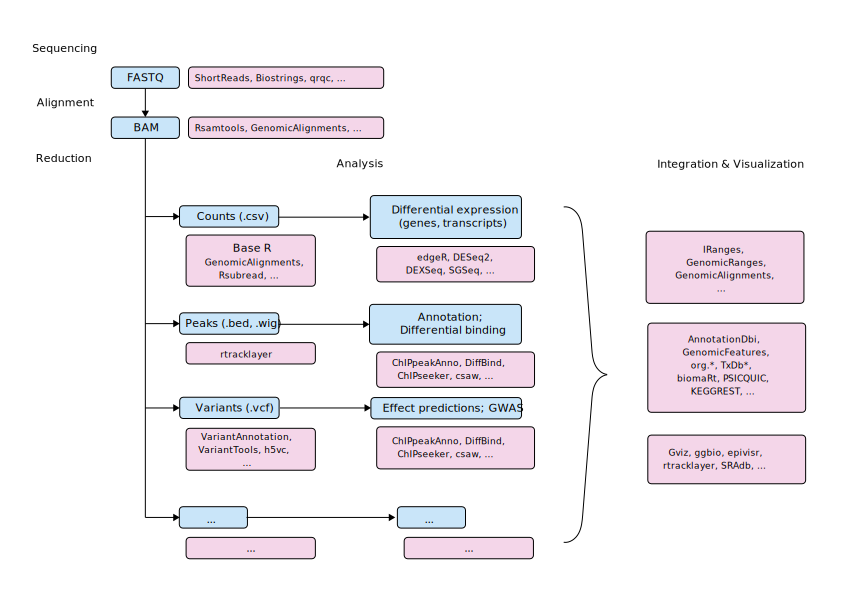

::::::::::::::::::::::::::::::::::::::: objectives

- Bioconductorプロジェクトについて全体を説明する。
- RエコシステムにおけるBioconductorプロジェクトの全体像を把握する。
- Bioconductorプロジェクトの今後の更新情報を監視するための情報源を特定する。

::::::::::::::::::::::::::::::::::::::::::::::::::

:::::::::::::::::::::::::::::::::::::::: questions

- Bioconductorプロジェクトには何が含まれていますか？
- BioconductorプロジェクトはCRANリポジトリとどのように関連していますか？
- Bioconductorのパッケージを効果的に使用するにはどうすればいいですか？
- Bioconductorコミュニティに参加し、コミュニケーションをとるにはどうすればいいですか？

::::::::::::::::::::::::::::::::::::::::::::::::::

## Bioconductorとは何ですか？

### Bioconductorの簡単な歴史

Bioconductorプロジェクトは2001年秋に始まり、計算生物学とバイオインフォマティクスのための拡張可能なソフトウェアの共同制作のためのイニシアティブとして立ち上げられました (Gentleman, Carey, Bates, Bolstad, Dettling, Dudoit, Ellis, Gautier, Ge, Gentry, Hornik, Hothorn, Huber, Iacus, Irizarry, Leisch, Li, Maechler, Rossini, Sawitzki, Smith, Smyth, Tierney, Yang, and Zhang, 2004)。
プロジェクトの初めから、記載された使命は、大規模データセットと厳密かつ堅牢に設計された実験の技術的成果物のための統計分析と理解のためのツールを開発することでした。
統計分析を超えて、統計結果の解釈は、生物学的文脈、視覚化、および再現性を提供するパッケージによってサポートされています。

年月が経つにつれて、Bioconductorプロジェクトに貢献したソフトウェアパッケージは、マイクロアレイから単一細胞ゲノミクスまで、さまざまな高スループット技術の進化と出現を反映してきました。シーケンシング実験の多くのバリエーション（例：RNA-seq、ChIP-seq、DNA-seq）、分析（例：塩基配列のばらつき、コピー数の変動、単一ヌクレオチド多型）、およびデータモダリティ（例：フローサイトメトリー、プロテオミクス、顕微鏡および画像分析）を通じて。

重要なのは、プロジェクトは新しい統計テストと方法論を実装するソフトウェアパッケージをリリースするだけでなく、分子注釈と実験データセットのデータベースへのアクセスを提供する多様なパッケージタイプを生産してきたことです。

Bioconductorプロジェクトは、夏に北アメリカで開催される年次会議でクライマックスに達し、地域会議はいずれもヨーロッパ、アジア、北アメリカでのネットワーキングに優れた機会を提供します。
このプロジェクトは多様で包括的なコミュニティの促進に取り組んでおり、[行動規範][bioc-code-of-conduct]を含む、行動規範委員会によって施行されています。

{alt='Major Bioconductor milestonesと技術の進歩のタイムライン。'}

**Major Bioconductor milestonesと技術の進歩のタイムライン。**
タイムラインの上部には、主要イベントの初めの発生が示されています。
タイムライン内では、コアインフラを提供するパッケージの名前がリリース日を示しています。
タイムラインの下部では、主要な技術的進歩がBioconductorプロジェクトの進化を時系列で文脈化します。

### 科学プロジェクト

元の出版物では、プロジェクトの設立時の目的と方法が説明されています Gentleman, Carey, Bates et al. (2004)。

Huber, Carey, Gentleman, Anders, Carlson, Carvalho, Bravo, Davis, Gatto, Girke, Gottardo, Hahne, Hansen, Irizarry, Lawrence, Love, MacDonald, Obenchain, Oles, Pages, Reyes, Shannon, Smyth, Tenenbaum, Waldron, and Morgan (2015)は、コアインフラとケーススタディの説明を含むプロジェクトの進展を、ユーザーと開発者の両方の視点から説明しています。

Amezquita, Lun, Becht, Carey, Carpp, Geistlinger, Marini, Rue-Albrecht, Risso, Soneson, Waldron, Pages, Smith, Huber, Morgan, Gottardo, and Hicks (2020)は、単一細胞ゲノミクス技術の目覚めに続くプロジェクトのさらなる発展をレビューしています。

多くの出版物や書籍の章がBioconductorプロジェクトを引用しており、最近の例は[Bioconductorウェブサイト][bioc-publications]にリストされています。

### パッケージリポジトリ

#### 概要およびCRANとの関係

間違いなく、ソフトウェアパッケージはBioconductorプロジェクトの最も知られている側面です。
2001年に設立されて以来、リポジトリは時間とともに成長し、数千のパッケージをホストするようになりました。

Bioconductorプロジェクトは、Rパッケージが主にバイオインフォマティクスと計算生物学の分析を対象にしている既存のCRANリポジトリを拡張しました。

:::::::::::::::::::::::::::::::::::::::::  callout

### さらに進む

このレッスンの[ディスカッション][discuss-cran]記事には、BioconductorとCRANの関係についてさらに詳しく説明しているセクションが含まれています。

::::::::::::::::::::::::::::::::::::::::::::::::::

#### Bioconductorリリースサイクル

Bioconductorプロジェクトは、CRANリポジトリのパッケージ管理インフラを拡張して、ユーザーのレベルでのパッケージの展開と管理をより良くサポートしました (Gentleman, Carey, Bates et al., 2004)。
特に、Bioconductorプロジェクトは、6か月のリリースサイクル（通常は4月と10月頃）を特徴としており、Bioconductorリポジトリ内のすべてのパッケージの現在のバージョンのスナップショットが特定のRバージョン用に指定されています。
R自体は年に1回リリースされ（通常は4月頃）、Rの各リリースごとに2つのBioconductorパッケージの互換性のあるリリースが利用可能になります。

そのため、Bioconductorパッケージ開発者は、次のBioconductorプロジェクトのリリースに関連付けられるRのバージョンを常に使用する必要があります。
これは、10月から4月の間はRの開発バージョンを使用し、4月から10月の間はRのリリースバージョンを使用することを意味します。

重要なのは、厳格なBioconductorリリースサイクルが、ユーザーが互いに非常に遠く離れたバージョンのパッケージをインストールできないようにし、テストを受ける可能性が低いパッケージをインストールできなくすることです。
この慣行は、CRANとBioconductorの両方のパッケージの開発サイクルを反映しており、同時のパッケージが自動化されたシステムによって定期的にテストされ、パッケージ依存関係内の最新のソフトウェア更新が下流のパッケージに壊れることがないことを保証します。これにより、パッケージのメンテナが自分のソフトウェアを更新することを促します。

各Bioconductorリリースの前に、必要な自動テストスイートを通過しないパッケージは廃止され、その後リポジトリから削除されます。
これにより、各Bioconductorリリースは、相互に互換性があり、追跡可能で、関連するRのバージョンで機能するパッケージのスイートを提供することが保証されます。

{alt='選択されたBioconductorおよびRのバージョンのリリース日タイムライン。'}

**選択されたBioconductorおよびRのバージョンのリリース日タイムライン。**
タイムラインの上部には、Rプロジェクトのバージョンとおおよそのリリース日が示されています。
タイムラインの下部には、Bioconductorプロジェクトのバージョンとリリース日が示されています。
出典: [Bioconductor][bioc-release-dates]。

#### パッケージタイプ

パッケージは、主に4つの主要カテゴリに分けられます。

- ソフトウェア
- 注釈データ
- 実験データ
- ワークフロー

[ソフトウェアパッケージ][glossary-software-package]自体は、データを保存してアクセスするためのインフラ（すなわち、クラス）を提供するパッケージと、そのデータ構造に保存されたデータを処理するための方法論的ツールを提供するパッケージに再分割できます。
この構造と分析の分離はBioconductorプロジェクトの中心にあり、新しい方法論的ソフトウェアパッケージの開発者が可能な限り既存のデータコンテナを再利用することを奨励し、異なるデータ構造間の学習と変換の必要なく、ユーザーが代替ワークフローをより容易に試すことができるようにします。

[注釈データパッケージ][glossary-annotation-package]は、多様なゲノム注釈の自己完結型データベース（例：遺伝子識別子、生物学的経路）を提供します。
さまざまなコレクションの注釈パッケージはBioconductorプロジェクトに存在します。
それらは、それぞれの命名パターンや含まれている情報によって識別できます。
たとえば、いわゆる`OrgDb`パッケージ（例として*[org.Hs.eg.db](https://bioconductor.org/packages/3.19/org.Hs.eg.db)*パッケージ）は、異なるタイプの遺伝子識別子および経路データベースをマッピングする情報を提供します。
いわゆる`EnsDb`（例として*[EnsDb.Hsapiens.v86](https://bioconductor.org/packages/3.19/EnsDb.Hsapiens.v86)*）パッケージは、BioconductorパッケージのEnsembl注釈の個別バージョンをカプセル化します。いわゆる`TxDb`パッケージ（例として*[TxDb.Hsapiens.UCSC.hg38.knownGene](https://bioconductor.org/packages/3.19/TxDb.Hsapiens.UCSC.hg38.knownGene)*）は、個別バージョンのUCSC遺伝子注釈テーブルをカプセル化します。

[実験データパッケージ][glossary-experiment-package]は、ソフトウェアパッケージの開発者が、[パッケージのビネット][glossary-vignette]において自分のパッケージの使用を示すためによく使用される自己完結型データセットを提供します。

最後に、[ワークフローパッケージ][glossary-workflow-package]は、他のパッケージの結合使用を示すビネットのコレクションを提供しますが、新しいソースコードや機能は提供しません。

:::::::::::::::::::::::::::::::::::::::  challenge

### チャレンジ: Bioconductorウェブサイト

Bioconductorウェブサイトは[https://bioconductor.org/](https://bioconductor.org/)からアクセス可能です。

ウェブサイトをブラウズして、次の質問に答える情報を見つけてください：

1. 現在のBioconductorプロジェクトのリリースにはいくつのパッケージが含まれていますか？
2. この数には各タイプのパッケージがいくつ含まれていますか？

:::::::::::::::  solution

### 解決策

以下の解決策には、執筆時点で有効だった数字（Bioconductorリリース3.13）が含まれています；
Bioconductorプロジェクトの将来のリリースでは、数字が異なることは避けられません。

1. [https://bioconductor.org/](https://bioconductor.org/)のページで、「インストール」というセクションを読むことができます。

> Bioconductorリリース3.13で利用可能な2042ソフトウェアパッケージを発見する。

2. [https://bioconductor.org/](https://bioconductor.org/)の「ニュース」セクションで、「Bioconductor Bioc `X.Y`リリース」というリンクをクリックしてください（`X.Y`は、この演習を通じて行くときの現在のBioconductorリリースのバージョン）。
  リンクされたページでは、以下の内容を読むことができます：

> Bioconductor 3.13を発表できることを嬉しく思います。これは2042ソフトウェアパッケージ、406の実験データパッケージ、965の注釈パッケージ、29のワークフローから構成されています。
>
> 新しいソフトウェアパッケージは133、新しいデータ実験パッケージは22、新しい注釈パッケージは7、新しいワークフローは1、新しい書籍はなく、多くの更新と既存パッケージの改善があります。Bioconductor 3.13はR 4.1.0と互換性があり、Linux、32ビットおよび64ビットのWindows、macOS 10.14.6 Mojave以上でサポートされています。 このリリースには更新されたBioconductor Dockerコンテナが含まれます。

:::::::::::::::::::::::::

::::::::::::::::::::::::::::::::::::::::::::::::::

#### biocViewsを使用したパッケージ分類

Bioconductorプロジェクトは、Bioconductorパッケージを分類し、[Bioconductorウェブサイト][biocviews-site]でのテーマ別検索を介してその発見を容易にするために、制御語彙からの用語の集合である[biocViews][glossary-biocviews]を使用します。

各Bioconductorパッケージは、パッケージのタイプと機能を説明するために選ばれた制御語彙からの小さな用語セットでタグ付けされます。
用語は最初にパッケージの著者によって選択され、次にパッケージレビューや制御語彙の更新中に精査されます。

:::::::::::::::::::::::::::::::::::::::  challenge

### チャレンジ

BioconductorのすべてのパッケージのリストをBioconductor [biocViews][biocviews-site]のウェブページで訪れてください。
左上の「Autocomplete biocViews search」ボックスを使用して、カテゴリ別にパッケージをフィルタリングし、個々の用語を展開および収縮させてソフトウェアパッケージのグラフを探ります。

1. RNAシーケンシング解析のためにタグ付けされたパッケージを識別するために使用できるbiocView用語は何ですか？ ChIP-seq？ エピジェネティクス？ バリアント注釈？ プロテオミクス？ 単一細胞ゲノミクス？
2. `RNASeq`カテゴリでは、非常に人気のある2つのパッケージがあり、*[DESeq2](https://bioconductor.org/packages/3.19/DESeq2)*と、*[edgeR](https://bioconductor.org/packages/3.19/edgeR)*です。
  ダウンロード統計（すなわち、低いランク）という点で、どちらがより人気がありますか？

:::::::::::::::  solution

### 解決策

1. `RNAseq`, `ChIPSeq`, `Epigenetics`, `VariantAnnotation`, `Proteomics`, `SingleCell`.

2. Bioconductorリリース`3.14`では、*[DESeq2](https://bioconductor.org/packages/3.19/DESeq2)*と*[edgeR](https://bioconductor.org/packages/3.19/edgeR)*がそれぞれランク23と28にリストされています。
  言い換えれば、2つのパッケージはBioconductorプロジェクトで最も頻繁にダウンロードされるパッケージの中にあり、この場合、*[edgeR](https://bioconductor.org/packages/3.19/edgeR)*に小さな利点があります。

:::::::::::::::::::::::::

::::::::::::::::::::::::::::::::::::::::::::::::::

:::::::::::::::::::::::::::::::::::::::::  callout

### さらに進む

Bioconductorパッケージ*[biocViews](https://bioconductor.org/packages/3.19/biocViews)*は、制御語彙のインフラをサポートおよび管理するために使用されます。
また、用語のリストをプログラム的に検査し、グラフとしてその関係によってサブセットを取得するためにも使用されます。

さらに、*[BiocPkgTools](https://bioconductor.org/packages/3.19/BiocPkgTools)*パッケージを使用して、異なる[biocViews][glossary-biocviews]のもとにあるパッケージをブラウズすることができます (Su, Carey, Shepherd, Ritchie, Morgan, and Davis, 2019)。

::::::::::::::::::::::::::::::::::::::::::::::::::

#### パッケージの相互運用性

Bioconductorの哲学の中心には、相互運用性の概念があります。
つまり、パッケージが同じデータ構造で動作する能力です。
重要なのは、相互運用性はユーザーと開発者の両方に利益をもたらすことです。

ユーザーは、複数のパッケージを組み合わせた任意の複雑なワークフローを書くことがより簡単になります。
同じデータ構造に基づくパッケージがあるため、ユーザーはワークフローの実際のステップに最大限注意を払い、各パッケージに特有の異なるデータ構造間で行う複雑かつエラーが発生しやすい変換に費やす時間を最小限に抑えることができます。
同様に、新しいパッケージの開発者は、情報の保存、検証、およびインデックスを行うために堅牢で信頼されるインフラを提供する既存のデータ構造を借用し、革新的な機能の実装に焦点を当てることができます。

最終的に、下図は、さまざまなBioconductorパッケージとベースRパッケージがどのように組み合わされて、シーケンシングデータをRセッションにインポートし、データと結果の注釈、統合、視覚化を実行するさまざまな分析を実行できるかを示しています。

{alt='シーケンシングエコシステム。'}

**シーケンシングエコシステム**
主要データ処理ステップ（青）と関連ソフトウェアパッケージ（ピンク）が、さまざまなタイプのゲノム分析の典型的なワークフローの文脈で一覧表示されます。

ワークフローのステップとソフトウェアパッケージの連続的な関係は、完全なエンドツーエンドのワークフローを構成するためのソフトウェアパッケージ間の相互運用性の重要性を示しています。
ワークフローのステップとソフトウェアパッケージの逐次関係は、完全なエンドツーエンドのワークフローを構成するために、ソフトウェアパッケージ間の相互運用性の重要性を示しています。

### 会議、コース、ワークショップ

Bioconductorコミュニティは、年中世界中の数多くのイベントを定期的に開催しています。 例えば：

- 北アメリカでの年次BioCサマー会議
- 冬の地域会議（例：BioC Europe、BioC Asia）
- サマー学校（例：CSAMA）
- すべてのコミュニティメンバーが参加できるオンラインミーティング（例：Bioconductor Developers Forum）

コース教材は、これらのイベントの各後に定期的に[Bioconductorウェブサイト][bioc-course-materials]にアップロードされます。
特に、[オンライン書籍][bioc-books]はコミュニティメンバーによって開発および維持されています。

Bioconductorの[YouTubeチャンネル][bioc-youtube]は、会議の発表のビデオ録画（講演やワークショップを含む）を公開するために使用され、通常のBioconductor開発者フォーラムの版（リンクが必要）も含まれています。

:::::::::::::::::::::::::::::::::::::::::  callout

### 貢献しよう！

年を通じての会議の典型的なサイクルを示すことができれば素晴らしいでしょう。例えば、

- 7月末頃の北アメリカでのBioC会議
- 12月頃のヨーロッパでのEuroBioC会議
- 11月頃のアジアでのBioCAsia会議

::::::::::::::::::::::::::::::::::::::::::::::::::

### オンラインコミュニケーションチャネル

#### サポートサイト

Bioconductorの[サポートサイト][bioc-support-site]は、ユーザーと開発者が自由にコミュニケーションをとるためのプラットフォームを提供し（Bioconductorの[行動規範][bioc-code-of-conduct]に従って）、パッケージに関する問題やベストプラクティスに関する概念的な質問について議論します。

#### Slackワークスペース

Bioconductorの[Slackワークスペース][bioc-slack]は、すべてのコミュニティメンバーが参加（無料）して、迅速な相互作用を行うことができるオープンスペースです。
現在、「Pro」プランの価格設定は、コア資金によって支援されています。

- 無制限のメッセージアーカイブ
- 無制限のアプリ
- 画面共有付きのグループビデオ通話
- Slack Connectを使用して他の組織と安全に作業する

さまざまなトピックについて議論するために多くのチャンネルが作成されており、コミュニティメンバーはそのチャンネルに自由に参加することができ、また新しいチャンネルを作成して新しいトピックについて議論することもできます。

重要な発表は`#general`チャンネルに投稿されます。

:::::::::::::::::::::::::::::::::::::::::  callout

### 注意

ユーザーは、Bioconductorの[サポートサイト][bioc-support-site]を使用して、より広いコミュニティに関連する問題を提起することを奨励されています。
Slack ワークスペースは、ライブディスカッションに最も便利で、広く参加しているチャンネル（例：`#general`）は適度に使用する必要があります。

::::::::::::::::::::::::::::::::::::::::::::::::::

#### 開発者メーリングリスト

[bioc-devel@r-project.org](mailto:bioc-devel@r-project.org) メーリングリストは、パッケージ開発者間のコミュニケーションや Bioconductor コアチームからの発表に使用されます。

### 科学技術コミュニティ

- [科学諮問委員会 (SAB)][bioc-scientific-advisory-board] 年に1度の会合、プロジェクトアドバイザーとして活動する外部および内部のリーダー。 任期の制限なし。
- [技術技術委員会 (TAB)][bioc-technical-advisory-board]。 月に一度、プロジェクトのコアインフラストラクチャと科学的方向性の技術的側面を検討します。 メンバーは 15 人、任期は 3 年。 年に一度の公開選挙でメンバーを交代します。 現在の役員は、ビンス・ケアリー（議長）、リーヴァイ・ウォルドロン（副議長）、シャーロット・ソネソン（書記）。
- [コミュニティ諮問委員会 (CAB)][bioc-community-advisory-board] 月に一度、地域社会への outreach、イベント、教育、トレーニングを考慮します。 メンバーは 15 人、任期は 3 年。 年に一度の公開選挙でメンバーを交代します。 現在の役員は、エイディン・カルハン（議長）、マット・リッチー（共同議長）、ローリ・カーン（書記）。
- [行動規範委員会][bioc-code-of-conduct]

:::::::::::::::::::::::::::::::::::::::::  callout

### 注意

TAB/CABの少なくとも1名のメンバーが両方に参加し、ボードのコミュニケーションを確保するための連絡役を果たします。

::::::::::::::::::::::::::::::::::::::::::::::::::

## 参考文献

[1] R. A. Amezquita, A. T. L. Lun, E. Becht, et al. "Orchestrating
single-cell analysis with Bioconductor". In: _Nat Methods_ 17.2 (2020),
pp. 137-145. ISSN: 1548-7105 (Electronic) 1548-7091 (Linking). DOI:
10.1038/s41592-019-0654-x.
<https://www.ncbi.nlm.nih.gov/pubmed/31792435>.

[2] R. C. Gentleman, V. J. Carey, D. M. Bates, et al. "Bioconductor:
open software development for computational biology and
bioinformatics". In: _Genome Biol_ 5.10 (2004), p. R80. ISSN: 1474-760X
(Electronic) 1474-7596 (Linking). DOI: 10.1186/gb-2004-5-10-r80.
<https://www.ncbi.nlm.nih.gov/pubmed/15461798>.

[3] W. Huber, V. J. Carey, R. Gentleman, et al. "Orchestrating
high-throughput genomic analysis with Bioconductor". In: _Nat Methods_
12.2 (2015), pp. 115-21. ISSN: 1548-7105 (Electronic) 1548-7091
(Linking). DOI: 10.1038/nmeth.3252.
<https://www.ncbi.nlm.nih.gov/pubmed/25633503>.

[4] S. Su, V. Carey, L. Shepherd, et al. "BiocPkgTools: Toolkit for
mining the Bioconductor package ecosystem [version 1; peer review: 2
approved, 1 approved with reservations] ". In: _F1000Research_ 8.752
(2019). DOI: 10.12688/f1000research.19410.1.

[bioc-code-of-conduct]: https://www.bioconductor.org/about/code-of-conduct/
[bioc-publications]: https://www.bioconductor.org/help/publications/
[discuss-cran]: discuss.html#bioconductor-and-CRAN
[bioc-release-dates]: https://bioconductor.org/about/release-announcements/
[glossary-software-package]: reference.html#software-package
[glossary-annotation-package]: reference.html#annotationdata-package
[glossary-experiment-package]: reference.html#experimentdata-package
[glossary-vignette]: reference.html#vignette
[glossary-workflow-package]: reference.html#workflow-package
[glossary-biocviews]: reference.html#biocviews
[biocviews-site]: https://www.bioconductor.org/packages/release/BiocViews.html
[bioc-course-materials]: https://bioconductor.org/help/course-materials/
[bioc-books]: https://www.bioconductor.org/books/release/
[bioc-youtube]: https://www.youtube.com/user/bioconductor
[bioc-support-site]: https://support.bioconductor.org/
[bioc-slack]: https://bioc-community.herokuapp.com/
[bioc-scientific-advisory-board]: https://bioconductor.org/about/scientific-advisory-board/
[bioc-technical-advisory-board]: https://bioconductor.org/about/technical-advisory-board/
[bioc-community-advisory-board]: https://bioconductor.org/about/community-advisory-board/

:::::::::::::::::::::::::::::::::::::::: keypoints

- R パッケージは Bioconductor プロジェクトの一側面に過ぎません。
- Bioconductor プロジェクトは CRAN リポジトリを拡張し、補完します。
- 異なる種類のパッケージは、ソフトウェアだけでなく、アノテーション、実験データも提供し、統合されたワークフローで複数のパッケージの使用方法を示します。
- Bioconductor パッケージ間の相互運用性は、統合ワークフローの作成を容易にし、ユーザーの認知的負担を最小限に抑えます。
- コースや会議の教育資料はアーカイブされ、Bioconductor ウェブサイトと YouTube チャンネルでアクセス可能です。
- 異なるコミュニケーションのチャネルを使用して、コミュニティのメンバーが会話し、ユーザーとパッケージ開発者の両方として互いに助け合います。
- Bioconductor プロジェクトは、科学、技術、諮問の各委員会および行動規範委員会によって運営されています。

::::::::::::::::::::::::::::::::::::::::::::::::::

